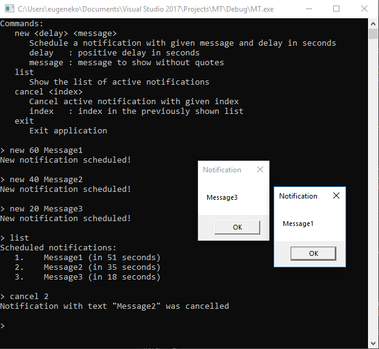

### Multithreading
# Лабораторная работа № 6

Требуется написать программу-"напоминалку", которая умеет показывать заданное сообщение через указанный промежуток времени.

Программа должна иметь консольный интерфейс вида "командная строка" со следующими доступными командами:

- new <задержка> <сообщение>
- list
- cancel <номер>
- exit

Консоль **должна** оставаться доступной для ввода команд все время работы программы.

Программа **не должна** завершаться с сообщением об ошибке ни при каких обстоятельствах.

При вводе команды **exit** программа должна мгновенно завершить работу.

Ниже приведены описания команд **new**, **list** и **cancel**.

### new

Команда **new** принимает в качестве параметров задержку в секундах и текст сообщения.

После вызова команды **new** через указанное количество секунд на экране должен появиться Message Box с заданным текстом.

### list

Команда **list** не принимает параметров.

После вызова команды **list** на экране должен появиться список всех сообщений, которые были запланированы с помощью команды **new**, но еще не были показаны на экране.

Для каждого сообщения на экране также должен быть указан его порядковый номер, а также время, через которое это сообщение должно появиться на экране.

### cancel

Команда **cancel** принимает в качестве параметра порядковый номер сообщения в списке.

После вызова команды **cancel** сообщение с соответствующим индексом должно быть удалено из списка (если это возможно)

Если список еще не был получен командой **list**, или список пустой, или индекс находится за пределами списка, не нужно делать ничего.

Команда **cancel** должна работать строго в соотвествтии со списком, который был выведен на экран с помощью команды **list**!

### Возможно, вам будут полезны...

- ::MessageBox(0, "text to display", "title", 0)
- time = std::chrono::steady_clock::now()
- duration_in_seconds = std::chrono::seconds(number_of_seconds)
- duration_in_seconds = std::chrono::duration_cast<std::chrono::seconds>(time2 - time1)

### Пример работы программы



### Пример реализации консоли

Вы можете воспользоваться данным кодом в качестве основы вашей программы:

https://ideone.com/pnk2I7

```
#include <cassert>
#include <iostream>
#include <sstream>
#include <string>

void New(int delay, std::string message)
{
   std::cout << "TODO: New" << std::endl;
}

void List()
{
   std::cout << "TODO: List" << std::endl;
}

void Cancel(int index)
{
   std::cout << "TODO: Cancel" << std::endl;
}

void Exit()
{
   std::cout << "TODO: Exit" << std::endl;
}

enum class CommandType
{
   None,
   New,
   List,
   Cancel,
   Exit
};

struct Command
{
   CommandType type{};
   int delay{};
   std::string message;
   int index{};

   Command() = default;
   Command(CommandType type) : type(type) {}
   Command(CommandType type, int delay, const std::string& message) : type(type), delay(delay), message(message) {}
   Command(CommandType type, int index) : type(type), index(index) {}
};

Command ReadCommand()
{
   std::string input;
   std::getline(std::cin, input);

   std::stringstream parser(input);
   std::string command;
   if (parser >> command)
   {
      if (command == "exit" || command == "x")
         return Command(CommandType::Exit);
      else if (command == "list" || command == "l")
         return Command(CommandType::List);
      else if (command == "cancel" || command == "c")
      {
         int index = 0;
         if (parser >> index)
            return Command(CommandType::Cancel, index);
         else
         {
            std::cerr << "Usage: cancel index" << std::endl
                      << "   index : index of the item to remove" << std::endl;
         }
      }
      else if (command == "new" || command == "n")
      {
         int delay = 0;
         if (parser >> delay)
         {
            if (delay > 0)
            {
               std::string message;
               std::getline(parser, message);
               if (!message.empty())
                  message = message.substr(1);
               return Command(CommandType::New, delay, message);
            }
            else
               std::cerr << "Delay must be positive" << std::endl;
         }
         else
         {
            std::cerr << "Usage: new delay message" << std::endl
                      << "   delay   : positive delay in seconds" << std::endl
                      << "   message : message to show without quotes" << std::endl;
         }
      }
      else
      {
         std::cerr << "Unknown command" << std::endl;
      }
   }

   return Command(CommandType::None);
}

int main()
{
   std::cout
      << "Commands:" << std::endl
      << "   new <delay> <message>" << std::endl
      << "      Schedule a notification with given message and delay in seconds" << std::endl
      << "      delay   : positive delay in seconds" << std::endl
      << "      message : message to show without quotes" << std::endl
      << "   list" << std::endl
      << "      Show the list of active notifications" << std::endl
      << "   cancel <index>" << std::endl
      << "      Cancel active notification with given index" << std::endl
      << "      index   : index in the previously shown list" << std::endl
      << "   exit" << std::endl
      << "      Exit application" << std::endl;

   while (true)
   {
      std::cout << std::endl << "> ";
      const auto command = ReadCommand();
      switch (command.type)
      {
      case CommandType::None:
         continue;
      case CommandType::Exit:
         Exit();
         return 0;
      case CommandType::New:
         New(command.delay, command.message);
         break;
      case CommandType::List:
         List();
         break;
      case CommandType::Cancel:
         Cancel(command.index);
         break;
      default:
         assert(0);
      }
   }
   return 0;
}
```

